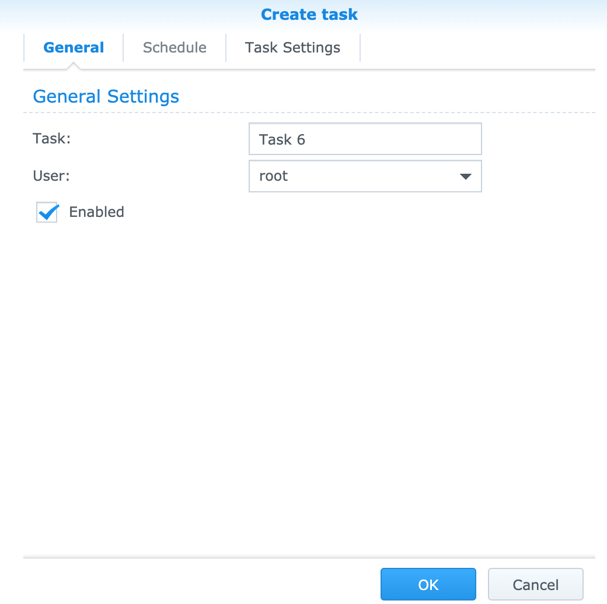
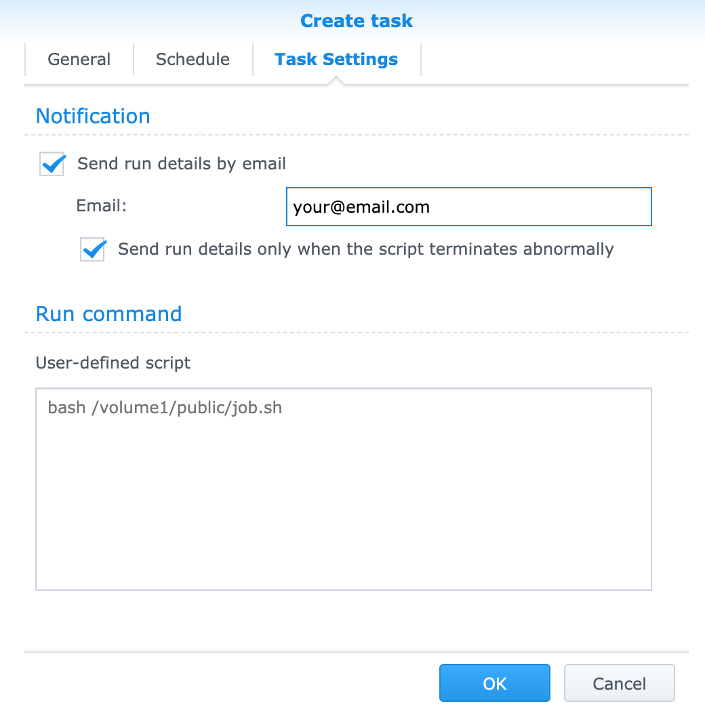

# SynologyCert2Drive
> A script to copy the SSL certs to the docker folder.

## Description
Check that the ssl file has been updated, copy from the synology ssl files to the target folder.
And restart docker container.

## How to use
Download this project to synology drive.

Copy `run.sh.example` file.
```bash
cp run.sh.example run.sh
```

Synology use some random alphanumeric name for ssl folder.

Use `root` user to find your synology ssl folder.

`renew.json` will show your `domains` if you find the folder.
```bash
sudo su
ls -la /usr/syno/etc/certificate/_archive
cat /usr/syno/etc/certificate/_archive/{some_folder}/renew.json
```

Edit variables

```bash
vim run.sh
```

```sh
## Variables
# path
SOURCE_PATH="/usr/syno/etc/certificate/_archive/your_cert_folder/"
TARGET_PATH="/volume1/your/target/path/"
# verify
VERIFY_DOMAIN_NAME="your.domain"
# docker
DOCKER_CONTAINER="container_name_for_restart"
```

Go to Synology UI Control Panel > Task Scheduler

Create > Scheduled Task > User-degined script

select user to root



Check `Send run details by email` and `Send run details only when the script terminates abnormally`

write command
```
bash /your/script/path/run.sh
```



